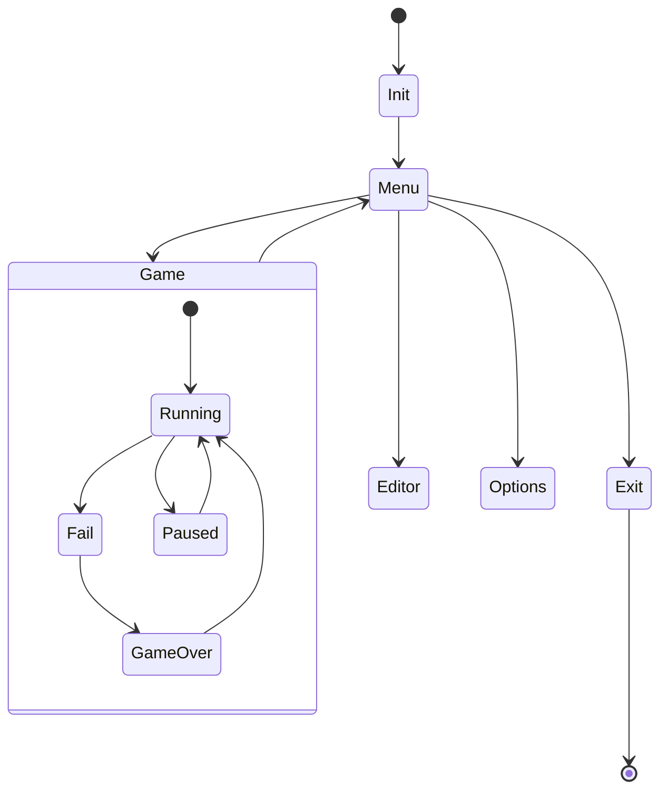

## Main Programm loop

```mermaid
stateDiagram-v2
    [*] --> Init
    Init-->Menu
    Menu-->Game
    state Game{
        [*] --> Running
        Running --> Fail
        Fail --> GameOver
        GameOver --> Running
        Running --> Paused
        Paused --> Running
    }
    Game-->Menu
    Menu-->Editor
    Menu-->Options
    Menu-->Exit

    Exit --> [*]
```
